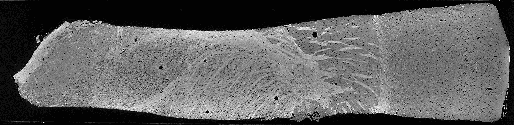
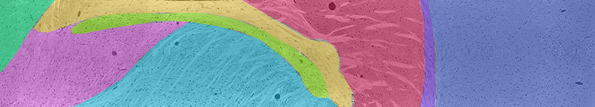
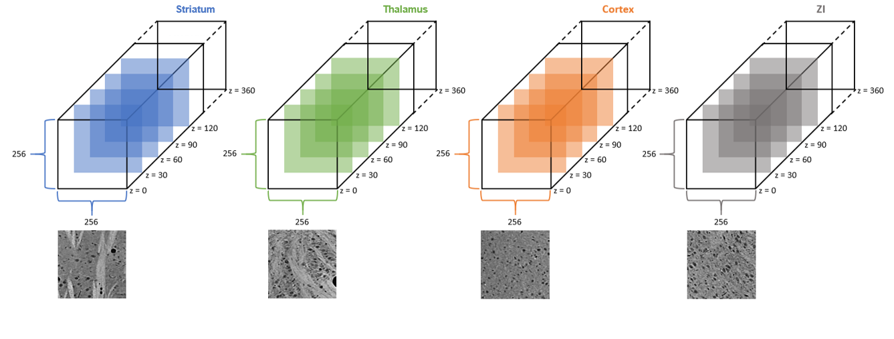

# Thalamocortical sample imaged with X-ray microCT
<u>A three-dimensional X-ray microtomography thalamocortical dataset for characterizing brain heterogeneity</u>: [Paper](http://bossdb.org/project/prasad2020), [Data](http://bossdb.org/project/prasad2020)

General requirements to run code associated with this project are <b>Python 3.x</b> and <b>Jupyter Notebook</b>. Additionally, to pull down the data from bossDB, we make use of [blosc](https://pypi.org/project/blosc/), [intern](https://pypi.org/project/intern/), and [numpy](https://pypi.org/project/numpy/), all of which can be installed via [pip](https://docs.python.org/3/installing/index.html).

Alternatively, to download all dependancies, navigate to your _local_ version of this repo via the command line and run
```bash
pip install -r requirements.txt
```
For further details about our versions of specific packages, please check [requirements.txt](https://github.com/nerdslab/xray-thc/blob/master/data_access_notebooks/requirements.txt)

# Dataset Description
This dataset consists of a 3D brain volume, generated via microCT, spanning from hypothalamus to cortex. The dataset has dimension 720x1420x5805 (z,y,x), with a 1.17um isotropic voxel volume. The brain areas available are Cortex, Striatum, TRN, VP, Zona Incerta, Internal Capsule, Hypothalamus, and Corpus Callosum. Human-annotated ground truth data are available for both brain area classification and samples for microstructure segmentation of 4 brain areas.

<!---

--->



Relevant notebooks:
1. [Pulling down raw data](https://github.com/nerdslab/xray-thc-data/blob/master/data_access_notebooks/raw_data_access.ipynb)

# Annotation Description
# Brain Area Classification
Brain area classification annotations are available for all brain areas. Complete human annotations of brain area are available for slices z = 109, 159, 209, 259, 309, 359, 409, 410, and 460. Thus, across each of these 9 slices, every pixel is labeled as belonging to one of the 8 brain areas mentioned in the dataset description. Interpolated annotations were computed and are made available for the slices between the human-annotated ones.

Brain areas were annotated with the following values: Clear Label = 0, Cortex = 1, Striatum = 2, TRN = 3, VP = 4, Zona Incerta = 5, Internal Capsule = 6, Hypothalamus = 7, Corpus Callosum = 8.

<!---

--->



Relevant notebooks:
1. [Pulling down area-level annotations](https://github.com/nerdslab/xray-thc-data/blob/master/data_access_notebooks/roi_access.ipynb)
2. [Pulling down raw data only from ROI of choice](https://github.com/nerdslab/xray-thc-data/blob/master/data_access_notebooks/mask_roi_example.ipynb)

# Microstructure Segmentation
Microstructure segmentation (of cell bodies, blood vessels, and myelinated axons) are available for 4 regions of interest: Cortex, Striatum, Thalamus (mostly VP and some TRN), and Zona Incerta. For each of these 4 regions, there is a 256x256x360 (x,y,z) volume available for which slice z (0 indexed) = 30, 60, 90, 120, 150, 180, 210, 240, 270, 300, and 330 have been densely annotated.

Microstructures were annotated with the following values: background = 0, cells = 1, blood vessels = 2, myelinated axons = 3.

<!---

--->



Relevant notebooks:
1. [Pulling down pixel-level annotations](https://github.com/nerdslab/xray-thc-data/blob/master/data_access_notebooks/annotation_access.ipynb)
2. [Pulling down raw data and pixel-level annotations jointly](https://github.com/nerdslab/xray-thc-data/blob/master/data_access_notebooks/training_data_access.ipynb)

# Data Access
Python notebooks for pulling down the data from BossDB, along with an instructional README, are provided in the "data_access_notebooks" directory.

# Team
- Aishwarya H. Balwani
- Eva L. Dyer
- William Gray Roncal
- Erik C. Johnson
- Joseph D. Miano
